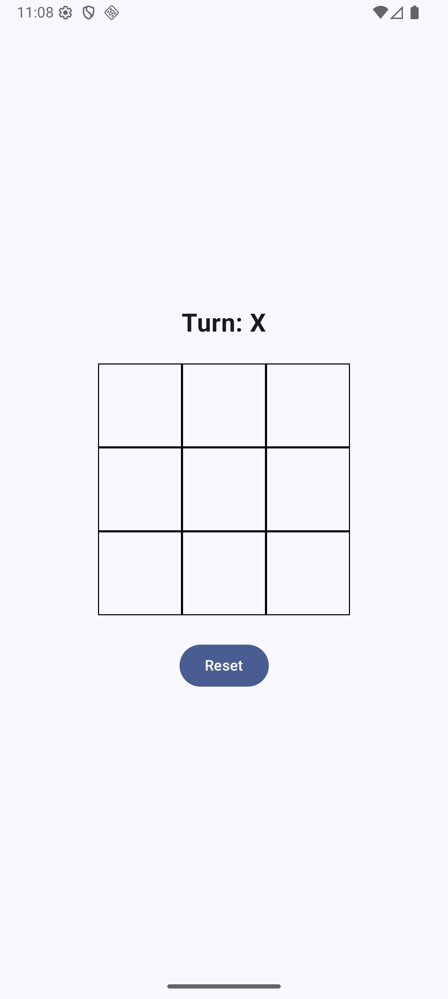
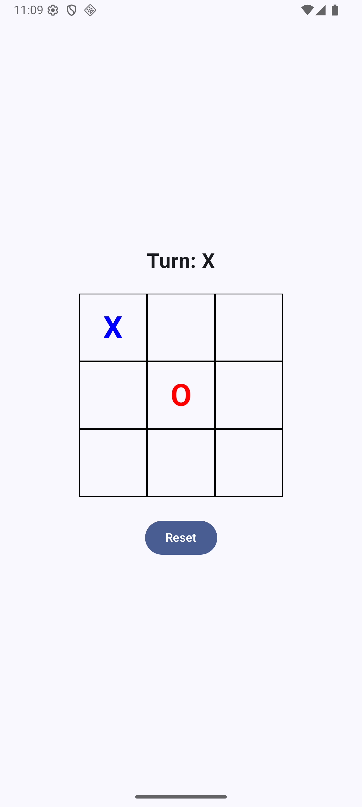
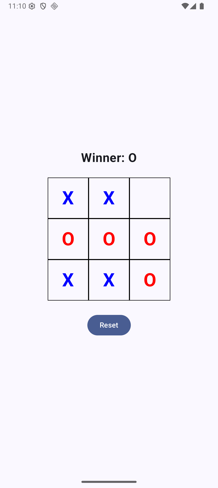
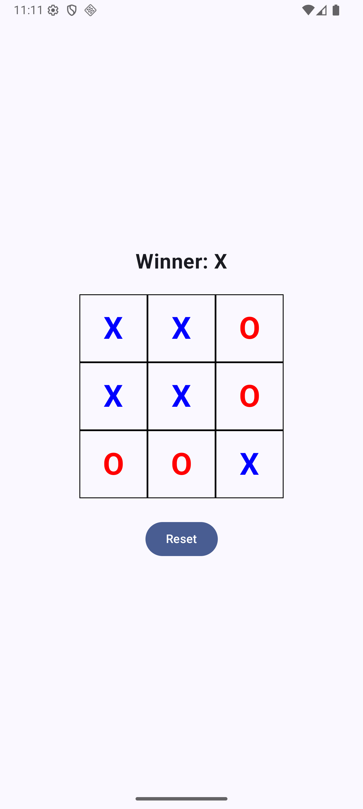

# TicTacToe

A Tic-Tac-Toe Android app built with Kotlin and Jetpack Compose, following TDD principles.

## Screenshots

| Game Start | In Progress | Win | Draw |
|:---:|:---:|:---:|:---:|
|  |  |  |  |

## Prerequisites
- Android Studio Hedgehog (2023.1.1) or later
- JDK 17+
- Android SDK 34+

## Run Unit Tests
```bash
./gradlew testDebugUnitTest
```
Or in Android Studio: Right-click `test` folder → Run Tests

## Build APK
```bash
./gradlew assembleDebug
```

## Run App
1. Open project in Android Studio
2. Select emulator or device
3. Click Run

## Architecture
- **Domain**: Pure Kotlin game logic (Game, Board, Player, GameState)
- **ViewModel**: Manages UI state via StateFlow
- **Compose UI**: Renders 3x3 grid and game status

## Game Rules
1. X always goes first
2. Players alternate placing X and O
3. Cannot play on occupied position
4. Three in a row (horizontal, vertical, diagonal) wins
5. Full board with no winner is a draw
6. Moves blocked after win/draw (must reset)

## Design Decisions
- State survives configuration changes via ViewModel
- Pure domain logic with no Android dependencies
- Developed using TDD (tests written first)
